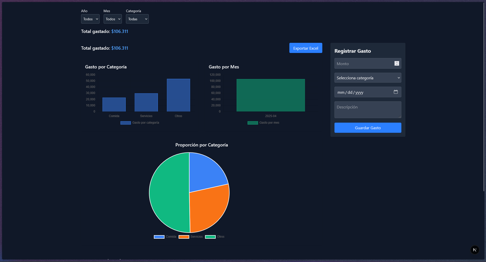
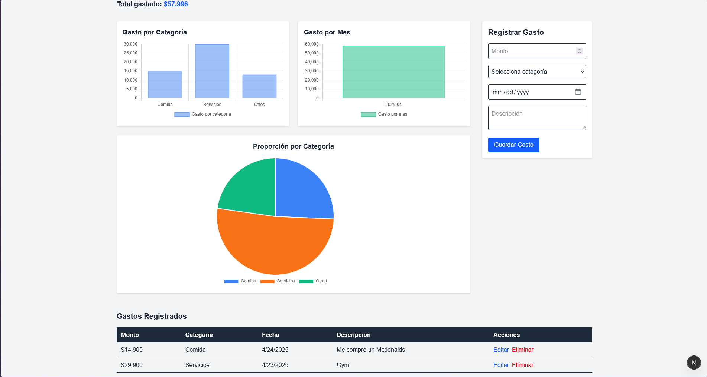

# Expense Tracker - Controla tus Gastos

[](https://vercel.com/import/project?template=https://github.com/h0kd/expense-tracker-nextjs)

Una aplicación web fullstack para registrar, visualizar y exportar tus gastos de manera simple, ordenada y eficiente.

## 🚀 Tecnologías utilizadas

- **Next.js 15** - Framework React de última generación
- **TailwindCSS 4** - Utilidades CSS para un diseño responsivo rápido
- **Prisma ORM** - Manejo de base de datos de forma segura y moderna
- **SQLite** - Base de datos liviana para desarrollo local
- **Chart.js** - Gráficos interactivos (barras, pastel)
- **Radix UI** - Diálogos accesibles y minimalistas
- **XLSX.js** - Exportación de datos a Excel

## ✨ Características principales

- Registrar nuevos gastos (monto, categoría, fecha, descripción)
- Visualización de gastos mediante gráficos dinámicos
- Filtros por año, mes y categoría
- Edición y eliminación de gastos
- Exportar gastos filtrados a **.xlsx**
- Diseño completamente responsivo
- Interfaz minimalista y moderna

## 📸 Capturas de pantalla





## 🛠️ Instalación local

1. Clona este repositorio

```bash
git clone https://github.com/h0kd/expense-tracker-nextjs.git
cd expense-tracker-nextjs
```

2. Instala las dependencias

```bash
npm install
```

3. Crea el archivo `.env`

```bash
DATABASE_URL="file:./dev.db"
```

4. Ejecuta las migraciones Prisma

```bash
npx prisma migrate dev --name init
```

5. Inicia el servidor de desarrollo

```bash
npm run dev
```

6. Abre [http://localhost:3000](http://localhost:3000) en tu navegador.

## 🚀 Deploy

Este proyecto está preparado para un deploy inmediato en [Vercel](https://vercel.com/):

1. Haz login en Vercel y conecta tu repositorio de GitHub.
2. Añade la variable de entorno `DATABASE_URL` en el panel de Vercel.
3. Importante: este proyecto usa **SQLite** local, por lo que si deseas un deploy funcional deberás conectar una base de datos en la nube (ej: Supabase, PlanetScale, etc.).
4. Si solo deseas mostrar el proyecto como portafolio, puedes desplegarlo tal como está (funcionará visualmente pero no podrá guardar datos).
5. ¡Publica tu proyecto con un solo click!

## 📃 Nota importante

> Esta aplicación funciona perfectamente a nivel local. Para uso en producción, se recomienda configurar una base de datos remota y actualizar `DATABASE_URL`.

## 📄 Licencia

Este proyecto es de uso libre para tu portafolio personal o como referencia de desarrollo.

---

Construido con pasión por **h0kd** ✨

